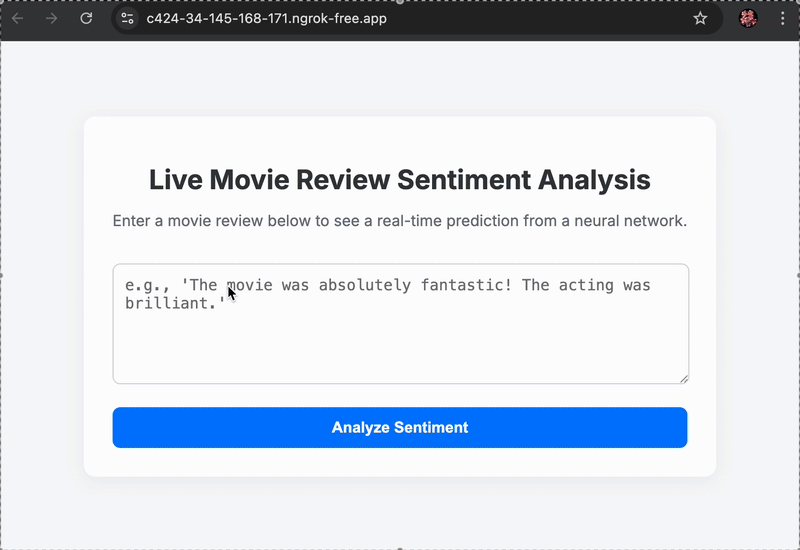

# Live Sentiment Analysis Web App

This project is an end-to-end prototype of a machine learning application that performs real-time sentiment analysis on movie reviews. It uses a neural network trained on the IMDB dataset, served via a Flask web application, and made temporarily public using `ngrok`.

The entire application is designed to run within a single Google Colab notebook, demonstrating a full development and prototyping cycle.

### Live Demo 

---

### Features

* **Real-Time Prediction:** Classifies text as "Positive" or "Negative" instantly.
* **Neural Network Core:** Built with TensorFlow and Keras, using an `Embedding` layer to understand word context.
* **Web Interface:** A clean and modern front-end built with HTML, CSS, and interactive JavaScript.
* **Flask Backend:** A lightweight Python web server that handles requests and interacts with the ML model.
* **Colab Prototyping:** Demonstrates the ability to train a model and launch a temporary web server for quick demos directly from a cloud environment using `ngrok`.

---

### Technologies Used

-   **Backend:** Python, Flask
-   **Machine Learning:** TensorFlow, Keras, Scikit-learn, NumPy
-   **Prototyping/Tunneling:** `pyngrok`
-   **Frontend:** HTML, CSS, JavaScript
-   **Environment:** Google Colaboratory

---

### How to Run This Project

You can run this entire project yourself with just a web browser.

1.  **Get an ngrok Account:**
    * Sign up for a free account at [ngrok.com](https://dashboard.ngrok.com/signup).
    * From your dashboard, find and copy your **authtoken**.

2.  **Open the Google Colab Notebook:**
    * [Sentiment_Analysis_Web_App.ipynb](Sentiment_Analysis_Web_App.ipynb)

3.  **Run the Code:**
    * Find the main code cell in the notebook.
    * Locate the line `authtoken = "NGROK_AUTH_TOKEN_HERE"` and paste your `ngrok` authtoken.
    * Run the cell by clicking the "Play" button. The script will install libraries, train the model, and launch the web server.

4.  **Access the Prototype:**
    * After a few minutes, a public `ngrok` URL will be printed at the bottom of the cell's output.
    * Click this URL to open the live web application in a new tab.
